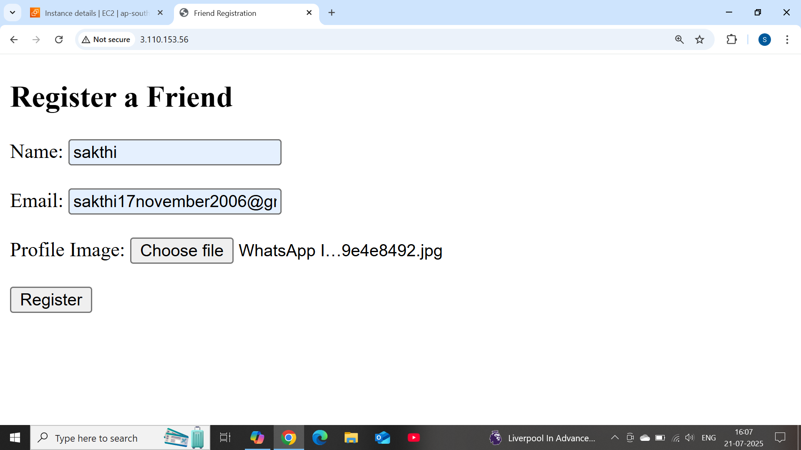
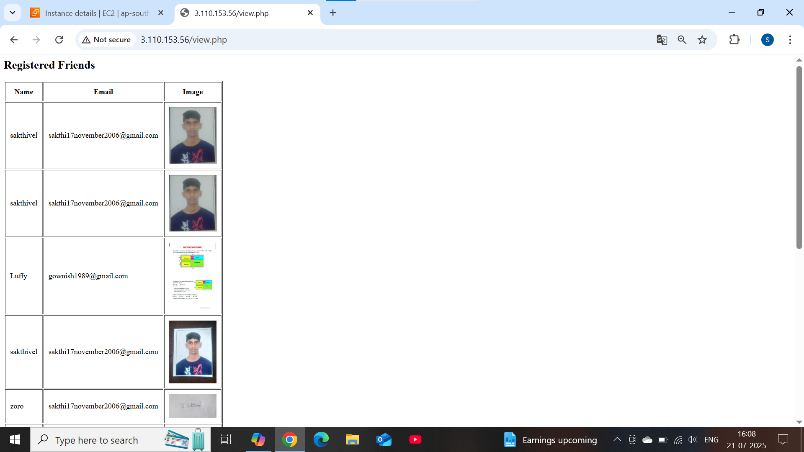

# 🧑‍🤝‍🧑 Friend Registration Web Server (AWS Deployment)

## 📌 Overview
This is a PHP-based web application deployed on **AWS EC2**, allowing users to register and view friend details. The app stores profile images in **Amazon S3** and data in **Amazon RDS (MySQL)**. It also includes an automated setup script to configure your EC2 instance.

---

## 🛠️ Technologies Used

| Layer        | Service         | Description                     |
|--------------|------------------|---------------------------------|
| Hosting      | EC2 Instance     | Apache + PHP web server         |
| Storage      | Amazon S3        | Stores uploaded profile photos |
| Database     | Amazon RDS (MySQL) | Stores registration data     |
| Automation   | setup.sh         | Installs Apache, PHP, and MySQL |

---

## 🚀 Features

- Register friend details with name, email, and profile photo
- Uploads images to an S3 bucket and stores metadata in RDS
- View all registered friends using `view.php`
- Automated EC2 server setup using `setup.sh`
- Structured code and screenshots for easy GitHub showcase

---

## 📁 Folder Structure
Friend-Registration/ ├── index.php ├── register.php ├── view.php ├── setup.sh  ├── index page.png │ registered page.png  | └── view page.png ├── README.md 

---

## 🖼️ Screenshots

### Registration Page  


### View Page  


---

## ⚙️ Setup Instructions

1. **Launch EC2 Linux instance**
2. **Clone this repository**:
   ```bash
   git clone https://github.com/YOUR_USERNAME/friend-registration.git
   cd friend-registration

## Run setup script:
   bash setup.sh
## database script
CREATE TABLE friends (
    id INT AUTO_INCREMENT PRIMARY KEY,
    name VARCHAR(100),
    email VARCHAR(100),
    image_url VARCHAR(255)
);
💡 Usage- Open index.php in browser → fill and submit the form
- register.php:
- Uploads image to S3
- Stores metadata (name, email, image URL) in RDS
- Visit view.php to see all entries in a table format
📬 ContactCreated by Sakthivel
📂 GitHub:https://github.com/sakthivel-40
